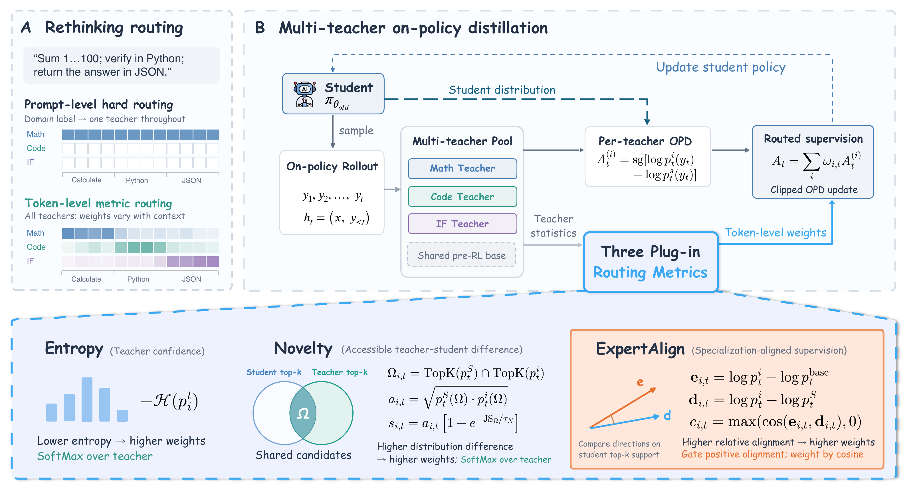

<div align="center">

<h2> MOPD-Router: Rethinking Teacher Routing in<br>Multi-Teacher On-Policy Distillation </h2>

[](https://arxiv.org/abs/2609.30837)
<!-- [](https://huggingface.co/papers/2604.02795) -->

A label-free, token-level teacher-routing framework for multi-teacher on-policy distillation.

</div>

## Overview

Multi-teacher on-policy distillation (MOPD) combines independently specialized teachers into a single student. Existing MOPD systems typically assign one domain-matched teacher to an entire rollout, which requires prompt-level domain labels and discards potentially useful signals from the other teachers.

**MOPD-Router** instead evaluates every student-generated token with the full teacher pool and dynamically weights the teachers' OPD signals. It requires neither domain labels nor a separately trained router. The framework exposes a common plug-in interface for three routing metrics:

- **Entropy,** routing toward confident teachers using predictive entropy.
- **Novelty,** measuring accessible teacher-student distributional difference on shared top-k support.
- **ExpertAlign**, selectig and weighting supervision whose teaching direction aligns with the specialization acquired by the teacher during post-training.



## Quick Start


### Requirements

- Python 3.10
- Multi-GPU environment


### Installation

```bash
conda create -n mopd-router python=3.10 -y
conda activate mopd-router

cd verl
USE_MEGATRON=0 bash scripts/install_vllm_sglang_mcore.sh
python -m pip install -e '.[vllm,math]'
cd ..
```

Install the additional benchmark dependencies when running evaluation:

```bash
python -m pip install -r benchmarks/requirements.txt
```


### Training

The specialized teacher checkpoints are hosted separately on Hugging Face:


| Domain                | Checkpoint                                                                                                                                                                 |
| --------------------- | -------------------------------------------------------------------------------------------------------------------------------------------------------------------------- |
| Math                  | [Keven16/Qwen3-4B-Non-Thinking-RL-Math-Step500](https://huggingface.co/Keven16/Qwen3-4B-Non-Thinking-RL-Math-Step500), released by [G-OPD](https://github.com/RUCBM/G-OPD) |
| Code                  | [Keven16/Qwen3-4B-Non-Thinking-RL-Code-Step300](https://huggingface.co/Keven16/Qwen3-4B-Non-Thinking-RL-Code-Step300), released by [G-OPD](https://github.com/RUCBM/G-OPD) |
| Instruction Following | [TianzeTurle/Qwen3-4B-RL-IF-Step500](https://huggingface.co/TianzeTurle/Qwen3-4B-RL-IF-Step500)                                                                            |


Set each teacher to a local checkpoint directory or Hugging Face model ID, then launch the public training entry point. 

```bash
export MATH_TEACHER_MODEL=Keven16/Qwen3-4B-Non-Thinking-RL-Math-Step500
export CODE_TEACHER_MODEL=Keven16/Qwen3-4B-Non-Thinking-RL-Code-Step300
export INSTRUCT_FOLLOWING_TEACHER_MODEL=TianzeTurle/Qwen3-4B-RL-IF-Step500
export TRAIN_DATA_PATH=/path/to/training-dataset.parquet

bash run.sh
```

The default configuration reproduces the strong-to-weak ExpertAlign setting: a Qwen3-1.7B student, three Qwen3-4B teachers, and Qwen3-4B as their shared pre-RL base. 

Run the same-size setting with:

```bash
STUDENT_MODEL=Qwen/Qwen3-4B \
EXPERIMENT_NAME=mopd-router-expertalign-qwen3-4b \
bash run.sh
```

### Routing Methods


| Method                           | Environment overrides                                                                                             |
| -------------------------------- | ----------------------------------------------------------------------------------------------------------------- |
| **ExpertAlign (ours)**           | `TEACHER_SIGNAL_AGGREGATION=delta DELTA_ROUTER_WEIGHTING=cosine`                                                  |
| - ExpertAlign, uniform weighting | `TEACHER_SIGNAL_AGGREGATION=delta DELTA_ROUTER_WEIGHTING=uniform`                                                 |
| Entropy                          | `TEACHER_SIGNAL_AGGREGATION=entropy ENTROPY_ROUTER_TEMPERATURE=0.1`                                               |
| - Calibrated Entropy             | `TEACHER_SIGNAL_AGGREGATION=entropy ENTROPY_ROUTER_TEMPERATURE=0.1 ENTROPY_CALIBRATION_ENABLED=true`              |
| Novelty                          | `TEACHER_SIGNAL_AGGREGATION=accessible_novelty ACCESSIBLE_NOVELTY_TOP_K=16 ACCESSIBLE_NOVELTY_JS_TEMPERATURE=0.1` |
| - Novelty-only ablation          | `TEACHER_SIGNAL_AGGREGATION=accessible_novelty ACCESSIBLE_NOVELTY_UTILITY_MODE=novelty_only`                      |
| Mean Aggregation                 | `TEACHER_SIGNAL_AGGREGATION=mean`                                                                                 |
| Standard MOPD                    | `ENTROPY_AWARE_ROUTER=false`                                                                                      |


For example, run the equal-weight baseline with:

```bash
TEACHER_SIGNAL_AGGREGATION=mean \
EXPERIMENT_NAME=mopd-mean-qwen3-1.7b \
bash run.sh
```

Standard MOPD expects every training row to contain `math`, `code`, or `instruction_following` in `extra_info.opd_teacher`:

```bash
TRAIN_DATA_PATH=/path/to/labeled-training-dataset.parquet \
ENTROPY_AWARE_ROUTER=false \
EXPERIMENT_NAME=standard-mopd-qwen3-1.7b \
bash run.sh
```


### Paper Configuration


| Parameter                                           | Value                 |
| --------------------------------------------------- | --------------------- |
| Epochs                                              | 3                     |
| Train / mini-batch size                             | 1,024 / 1,024         |
| Learning rate                                       | 1e-5, constant        |
| Gradient clipping                                   | 1.0                   |
| PPO clip epsilon                                    | 0.2                   |
| Prompt / response limit                             | 2,048 / 16,384 tokens |
| Rollout samples                                     | 1                     |
| Rollout temperature / top-p                         | 1.0 / 1.0             |
| KL penalty                                          | disabled              |
| Thinking mode                                       | disabled              |
| ExpertAlign top-k / alignment margin                | 16 / 1e-6             |
| Entropy routing temperature                         | 0.1                   |
| Novelty top-k / JS saturation / routing temperature | 16 / 0.1 / 0.1        |


W&B logging is disabled by default. To enable it, export credentials through the environment:

```bash
export WANDB_MODE=online
export WANDB_API_KEY='your-key'
bash run.sh
```

For multi-node training, set `NNODES` and `NGPUS_PER_NODE`, then launch `run.sh` inside an existing Ray/torch distributed environment.

## Evaluation

The unified evaluator accepts a Hugging Face checkpoint directory, a verl `global_step_N` directory, or an `actor` directory. Preview the generated commands without loading a model:

```bash
python tools/evaluate_checkpoint.py /path/to/checkpoint \
  --benchmarks all \
  --gpus 0,1,2,3,4,5,6,7 \
  --dry-run
```

Run the paper's math and code configuration:

```bash
python tools/evaluate_checkpoint.py /path/to/checkpoint \
  --benchmarks math,code \
  --gpus 0,1,2,3,4,5,6,7 \
  --math-n 8 \
  --code-n 1 \
  --temperature 0.7 \
  --top-p 0.8 \
  --top-k 20
```

Run instruction-following evaluation with five independent completions per instance:

```bash
python tools/evaluate_checkpoint.py /path/to/checkpoint \
  --benchmarks instruction \
  --gpus 0,1,2,3,4,5,6,7 \
  --if-n 5 \
  --if-temperature 0.7 \
  --if-top-p 0.8 \
  --if-top-k 20
```


| Alias         | Benchmarks                                                   |
| ------------- | ------------------------------------------------------------ |
| `math`        | AIME 2024, AIME 2025, HMMT February 2025, HMMT November 2025 |
| `code`        | HumanEval+, MBPP+, LiveCodeBench v6                          |
| `instruction` | IFEval, IFBench                                              |
| `all`         | All nine benchmarks                                          |


EvalPlus executes generated Python programs. Run code evaluation in an isolated environment suitable for untrusted code.

## Repository Structure

```text
MOPD-Router/
├── run.sh                          # Public training entry point
├── figure/                         # Framework figure (PNG and PDF)
├── tools/                          # Evaluation, data, and checkpoint utilities
├── benchmarks/
│   ├── math_eval/                  # Math evaluation and released data
│   ├── code_eval/                  # EvalPlus and LiveCodeBench runners
│   ├── IFBench/                    # IFBench evaluation
│   └── instruction_following_eval/ # IFEval evaluation
└── verl/                           # G-OPD/verl training implementation
```

The release contains the prepared training and validation data used by the public entry points. Model weights, teacher checkpoints, experiment checkpoints, and generated outputs are not included.

## Citation

```
@misc{xu2026mopdrouterrethinkingteacherrouting,
      title={MOPD-Router: Rethinking Teacher Routing in Multi-Teacher On-Policy Distillation}, 
      author={Tianze Xu and Yanzhao Zheng and Zhentao Zhang and Yuanqiang Yu and Chao Ma and Jihuai Zhu and Lelun Wu and Lyumanshan Ye and Pengfei Liu and Baohua Dong and Hangcheng Zhu and Ruohui Huang and Gang Yu},
      year={2026},
      eprint={2609.30837},
      archivePrefix={arXiv},
      primaryClass={cs.LG},
      url={https://arxiv.org/abs/2609.30837}, 
}
```

## Acknowledgements

This codebase builds on [G-OPD](https://github.com/RUCBM/G-OPD) and its vendored [verl](https://github.com/volcengine/verl) v0.6.1 training stack. We thank their authors and the developers of the included evaluation suites.
